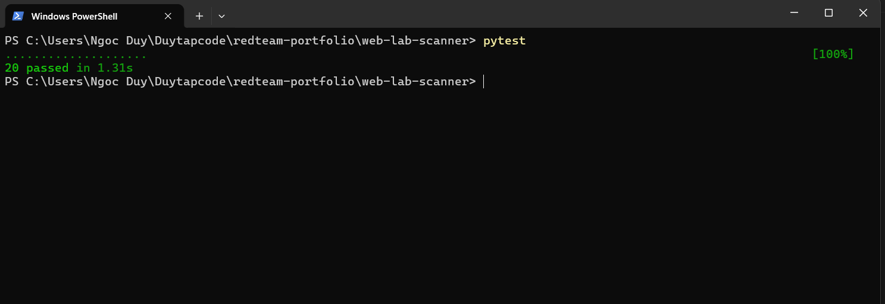
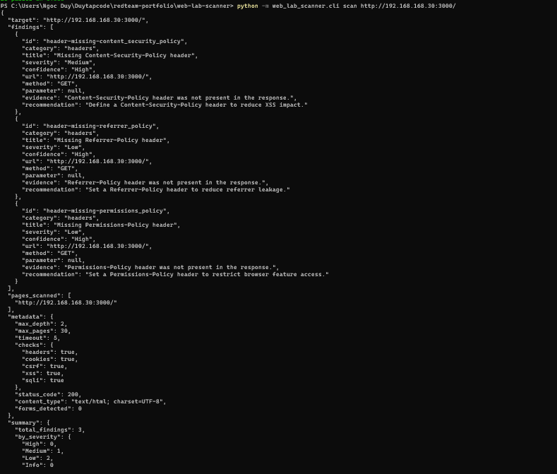
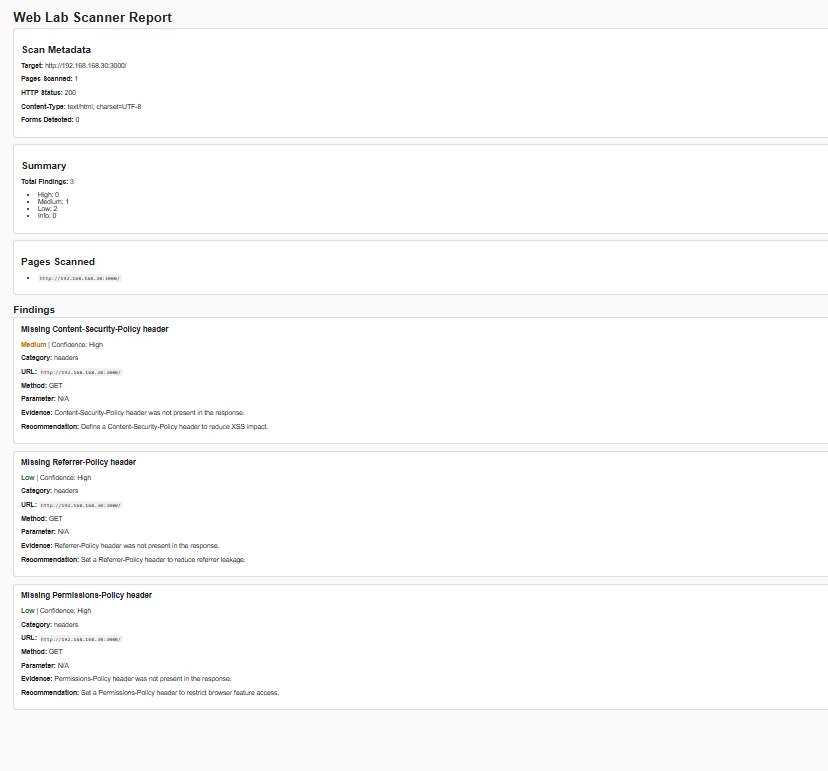

# Web Lab Scanner

A session-aware Python CLI scanner for lab web applications such as DVWA, Juice Shop, and similar OWASP-style training targets.

## Overview

Web Lab Scanner was built to practice web security engineering through a real tool instead of one-off scripts. It combines HTTP interaction, limited crawling, security header analysis, form parsing, CSRF heuristics, reflected XSS probing, SQL error probing, structured findings, and report generation.

## Features

- Session-aware scanning with a shared HTTP session
- Cookie and custom header injection
- Same-host internal crawling with depth and page limits
- Security header analysis
- Cookie flag analysis
- HTML form extraction
- CSRF token heuristic detection for POST forms
- Reflected XSS indicator probing
- SQL error indicator probing
- Structured findings with severity, confidence, evidence, and recommendations
- JSON and HTML reporting
- Unit and integration tests

## Project Structure

    src/web_lab_scanner/
      cli.py
      scanner.py
      session_manager.py
      http_client.py
      crawler.py
      config.py
      models.py
      analyzers/
        headers.py
        cookies.py
        forms.py
        csrf.py
        xss.py
        sqli.py
      reporters/
        json_reporter.py
        html_reporter.py

    tests/
    configs/
    examples/
    docs/

## Installation

    python -m pip install -e .[dev]

## Usage

### Scan a target directly

    python -m web_lab_scanner.cli scan http://192.168.168.30:3000/

### Generate JSON and HTML reports

    python -m web_lab_scanner.cli scan http://192.168.168.30:3000/ --json .\examples\sample_report.json --html .\examples\sample_report.html

### Scan using config

    python -m web_lab_scanner.cli scan --config .\configs\juice_shop.yaml

## Configuration Example

    target: http://192.168.168.30:3000/
    max_depth: 2
    max_pages: 30
    timeout: 5

    auth:
      cookies: []
      headers:
        - "User-Agent: WebLabScanner/0.1.0"

    checks:
      headers: true
      cookies: true
      csrf: true
      xss: true
      sqli: true

    output:
      json: examples/sample_report.json
      html: examples/sample_report.html

## Sample Findings

Example output from a Juice Shop lab scan:

- Missing Content-Security-Policy header
- Missing Referrer-Policy header
- Missing Permissions-Policy header

## Testing

Run the full test suite with:

    pytest

Current local milestone result:

- 20 tests passing
- Unit tests for analyzers and helpers
- Integration tests for reflected XSS and SQLi indicators

## Screenshots

### Test run

### CLI scan output

### HTML report

## Architecture

See `docs/architecture.md` for the current system design and component breakdown.

## Current Limitations

- The crawler is designed for server-rendered HTML links and does not execute JavaScript.
- Client-side SPA routes behind fragment identifiers such as `#/...` are not fully enumerated.
- Reflected XSS and SQLi checks are heuristic indicators, not exploit confirmation.
- Root-page scans against modern SPAs may produce fewer crawl results than traditional server-rendered apps.

## Safety

This tool is intended only for:

- Local lab environments
- Training targets
- Systems you own or are explicitly authorized to test

## Status

This project currently includes:

- Session-aware target fetching
- Limited internal crawling
- Passive checks for headers and cookies
- Form parsing and CSRF heuristics
- Active reflected XSS and SQLi indicator probes
- JSON and HTML reporting
- Automated test coverage

## Roadmap

Planned next improvements:

- Broader multi-page analysis beyond the initial response
- Richer HTML report styling
- Expanded form-driven probing
- Optional authenticated workflows for additional lab targets